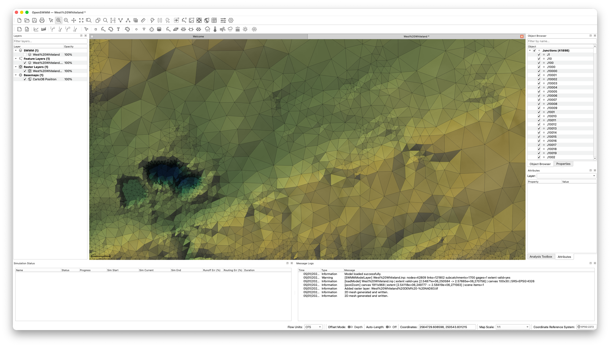

# OpenSWMM GUI

<p align="center">
   
</p>

**Qt6/C++ graphical user interface for the OpenSWMM storm-water simulation engine (v6.0.0)**

[](../../actions/workflows/build_and_test.yml)
[](../../actions/workflows/documentation.yml)
[](LICENSE)

---

## Overview

A new GIS-based graphical user interface being developed for SWMM 6.0. The application is built with C++20 and the Qt 6 framework, providing tight integration with the next-generation OpenSWMM computational engine.

Key capabilities:

- Interactive map canvas with pan/zoom, CRS reprojection, and layer management (vector, raster, WMS/WMTS, XYZ tiles, SWMM model & results layers)
- SWMM model setup, editing, and validation
- Simulation control and results visualization
- GIS data import/export via GDAL

## Dependencies

| Dependency | Version | Notes |
|---|---|---|
| [Qt](https://www.qt.io/) | 6.5+ | Widgets, OpenGL, Network, Concurrent, Svg, Charts |
| [GDAL](https://gdal.org/) | 3.x | GIS/CRS support — installed via vcpkg |
| [openswmm.engine](https://github.com/HydroCouple/openswmm.engine) | branch `swmm6_rel` | Engine — expected at `../openswmm.engine` |
| [QPropertyModel](https://github.com/cbuahin/QPropertyModel) | branch `dev` | Property editor — expected at `../QPropertyModel` |
| [vcpkg](https://github.com/microsoft/vcpkg) | `2025.03.19` | Package manager |
| CMake | 3.21+ | Build system |

## Building

### 1. Clone sibling repositories

All three repos must be siblings in the same parent directory:

```bash
# From the directory that will contain all repos:
git clone -b swmm6_gui  https://github.com/HydroCouple/openswmm.gui.git
git clone -b swmm6_rel  https://github.com/HydroCouple/openswmm.engine.git openswmm.engine
git clone -b dev        https://github.com/cbuahin/QPropertyModel.git QPropertyModel
git clone               https://github.com/microsoft/vcpkg.git

cd vcpkg
./bootstrap-vcpkg.sh   # Windows: bootstrap-vcpkg.bat
cd ..
```

### 2. Install Qt 6

Download and install Qt 6.5+ via the [Qt Online Installer](https://www.qt.io/download), then set the `QT_ROOT_DIR` environment variable to point to the kit directory:

```bash
# Linux example
export QT_ROOT_DIR=$HOME/Qt/6.7.0/gcc_64
# macOS example
export QT_ROOT_DIR=$HOME/Qt/6.7.0/macos
```

### 3. Configure and build

```bash
cd openswmm.gui

# macOS (Release)
cmake --preset=Darwin
cmake --build --preset=Darwin

# Linux (Release)
cmake --preset=Linux
cmake --build --preset=Linux

# Windows (Release) — from a Visual Studio Developer Prompt
cmake --preset=Windows
cmake --build --preset=Windows
```

Debug builds append `-debug` to the preset name (e.g., `Darwin-debug`).

### 4. Run tests

```bash
cmake --preset=Darwin -DSWMMVIS_BUILD_TESTS=ON
cmake --build --preset=Darwin
ctest --test-dir build/darwin -C Release --output-on-failure
```

## API Documentation

Generated with Doxygen and published to GitHub Pages on every push to `main`/`swmm6_gui`:

```bash
doxygen docs/Doxyfile   # output → docs/html/
```

## Disclaimer

This open-source project is provided on an "as is" basis and the user assumes responsibility for its use.
