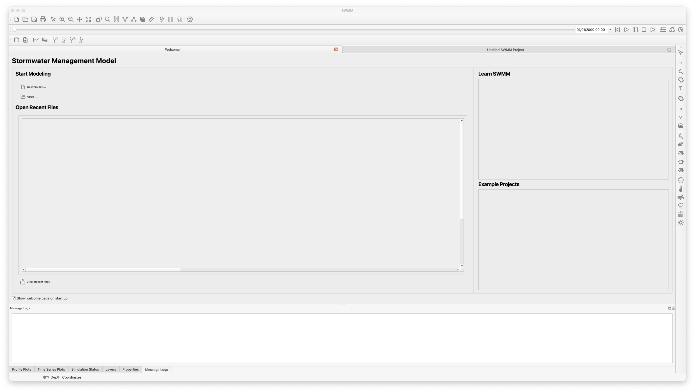
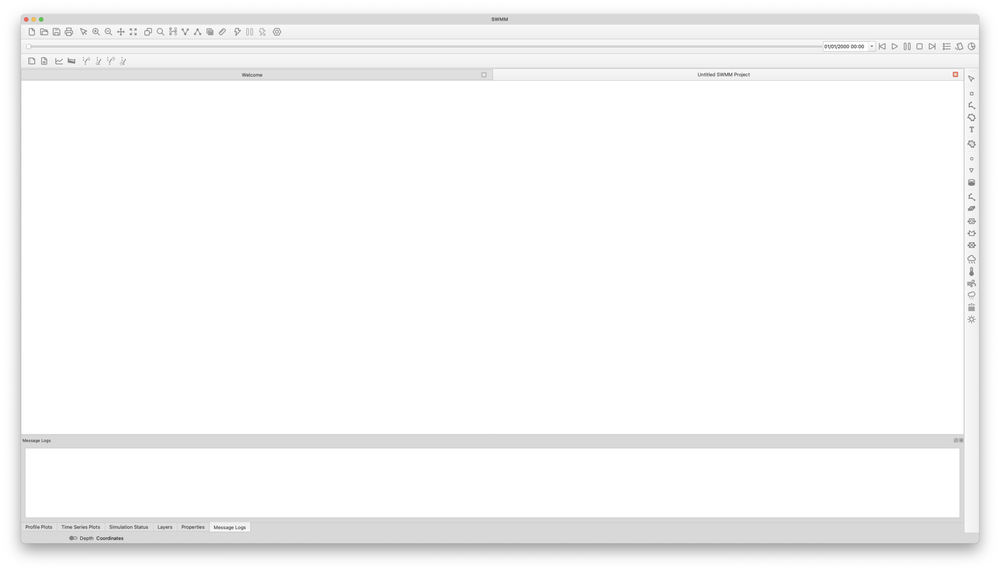

SWMMVis - ORD Stormwater-Management-Model Graphical User Interface
==================================

A graphical user interface for the SWMM model 

  

## Introduction

New GIS-Based Graphical User Interface being developed for SWMM 6.0. The GUI 
is being written using C++ and the Qt framework to allow for better integration
with the new SWMM engine that is being developed using C/C++.

## Dependencies

## Installation

TODO

## Disclaimer 
The United States Environmental Protection Agency (EPA) GitHub project code is provided on an "as is" basis and the user assumes responsibility for its use. EPA has relinquished control of the information and no longer has responsibility to protect the integrity, confidentiality, or availability of the information. Any reference to specific commercial products, processes, or services by service mark, trademark, manufacturer, or otherwise, does not constitute or imply their endorsement, recommendation or favoring by EPA. The EPA seal and logo shall not be used in any manner to imply endorsement of any commercial product or activity by EPA or the United States Government.

## Find Out More
The source code distributed here is identical to the code found at the official [SWMM Website](http://www2.epa.gov/water-research/storm-water-management-model-swmm).
