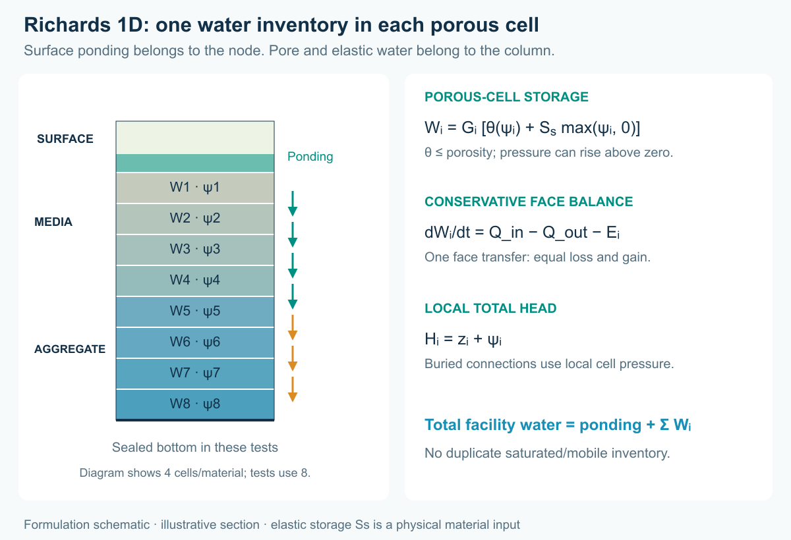
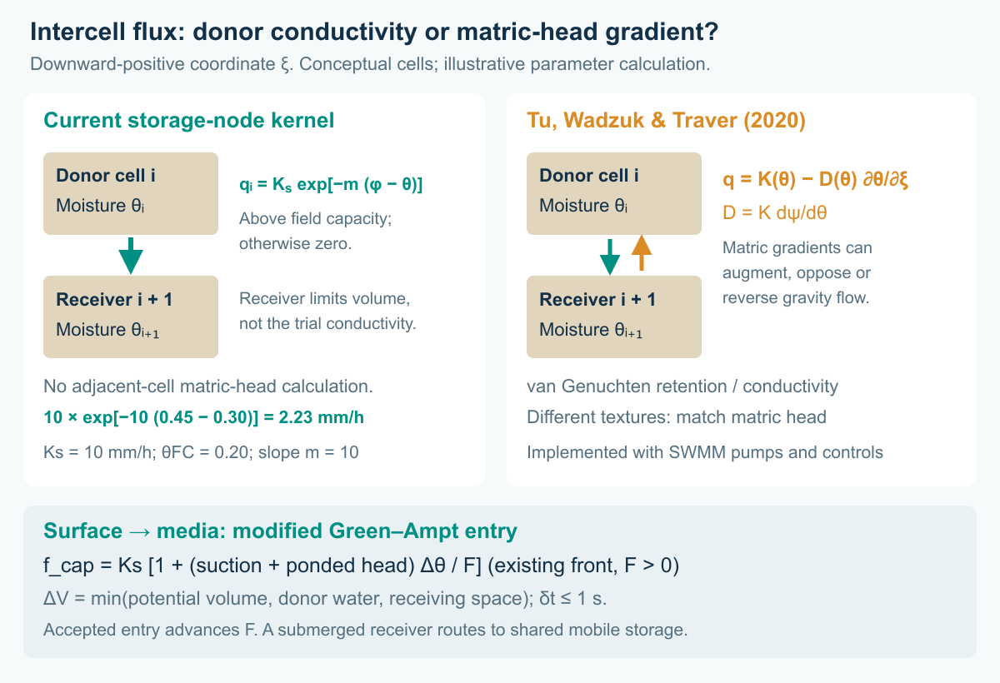
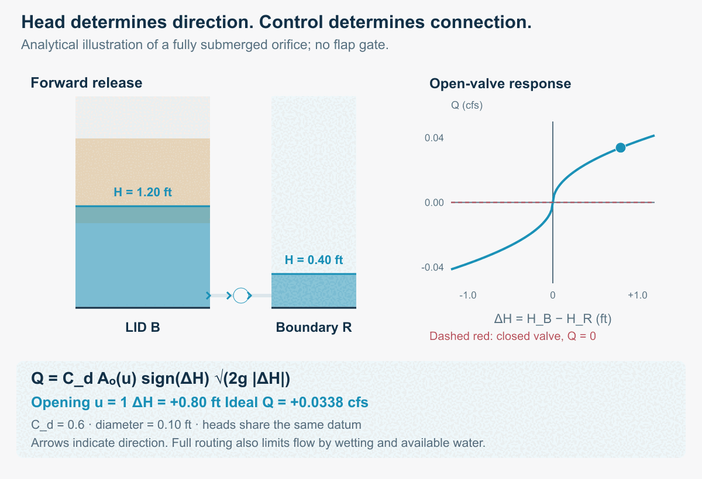
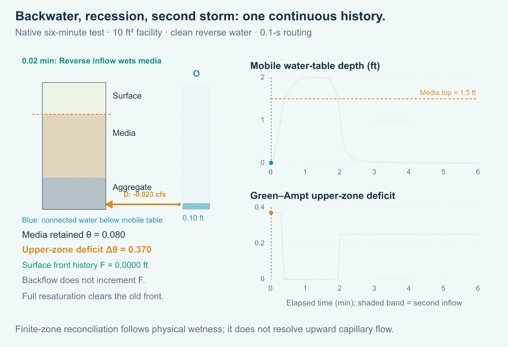
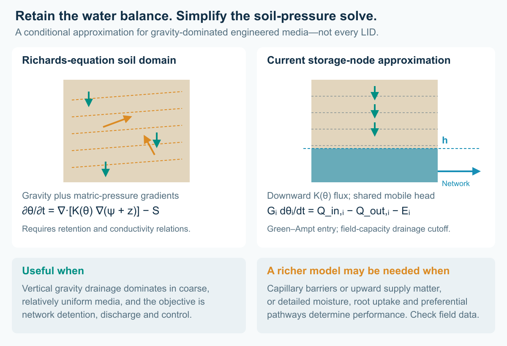
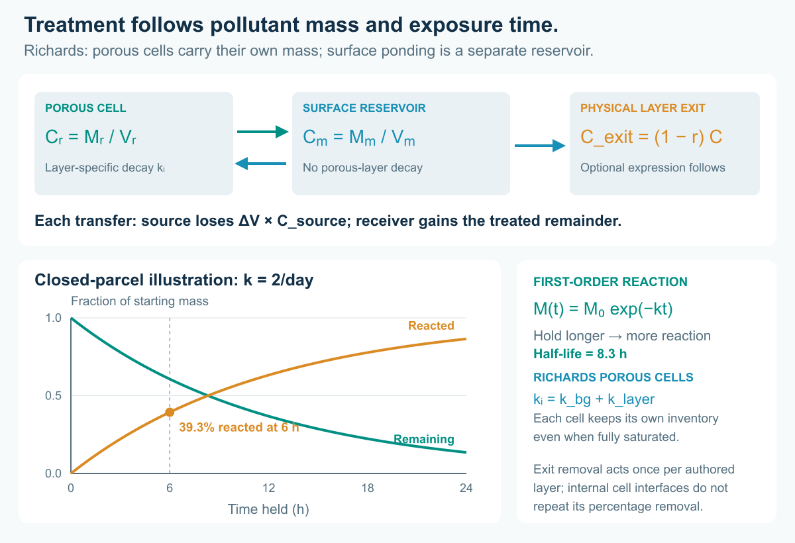
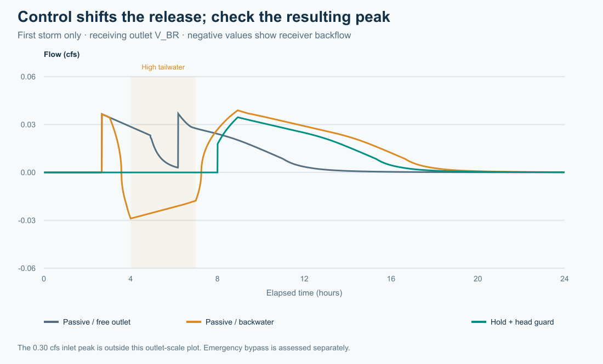
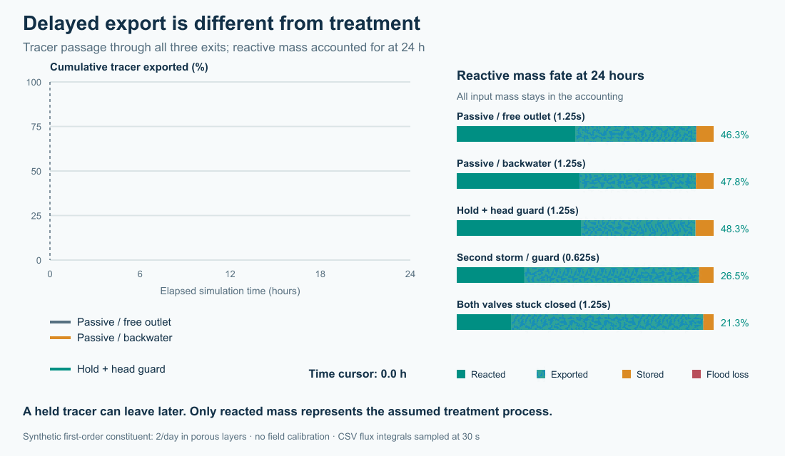

# Hydraulic Controls and Distributed LID in Open-Source SWMM 6

### From individual practices to distributed systems: detention, treatment, active control and receiving waters

Caleb Buahin
October 4, 2026

A rain garden can perform well on its own and still be part of a drainage system that performs poorly. Its outlet may meet a high downstream water level. Several facilities may release together. Holding water for treatment may leave too little capacity for the next storm. And water that infiltrates does not necessarily disappear from the watershed.

These questions have motivated the new LID Storage node implementation in Open-Source SWMM 6 (SWMM2D). The aim is to move beyond evaluating performance of localized low impact development practices and examine the system-wide implications of distributed LIDs for receiving groundwater and water bodies: flow peaks, timing, cumulative pollutant loads and the pathways connecting facilities.

*Figure 1. A simulated storm moves through two layered storage nodes. Blue arrows show forward flow; amber arrows show reversal; crosses mark closed valves. The receiving-water stage rises between hours 3 and 4, stays high until hour 7, then falls. Dots indicate direction, not tracked particles. Blue fill shows mobile water; teal shows perched surface ponding. Cross-sections are schematic and use a common head datum. [Static figure](assets/network-static.png).*

## Why the network matters

Conventional SWMM LIDs describe rainfall, infiltration and drainage within a subcatchment. SWMM can also represent treatment trains by routing runoff between dedicated subcatchments; LIDs within one subcatchment are treated in parallel. See the [EPA SWMM 5.2 User's Manual](https://nepis.epa.gov/Exe/ZyPURL.cgi?Dockey=P10145M6.TXT).

**SWMM 5 already provides LID drain controls.** Version **5.1.013 (August 2018)** added separate drain opening and closing water levels and a control curve that adjusts nominal drain discharge as a function of the head above the drain outlet. These controls respond to water levels within the LID; the conventional LID underdrain calculation does not include the receiving node's downstream head. [EPA release notes](https://github.com/USEPA/Stormwater-Management-Model/releases/tag/v5.1.13); [EPA LID underdrain implementation](https://github.com/USEPA/Stormwater-Management-Model/blob/develop/src/solver/lidproc.c).

The new work connects the layered LID directly to SWMM's existing hydraulic network and control rules. **Its outlet flow responds to both the facility's head and the downstream head**, allowing backwater to restrict drainage and, where the link permits it, reverse flow into the facility. Controls can also respond to receiving-water levels. This couples the layered water stores and treatment processes to the surrounding network.

For the layered facility, this supports questions such as:

- Does detention at an upstream facility reduce a downstream peak, or move it into the peak from another tributary?
- How does downstream backwater change available storage, flow direction and exposure to treatment media?
- Can a controller retain polluted runoff while preserving capacity for a second storm?
- How much pollutant is transformed, discharged, bypassed or still stored at the end of the assessment?

Research on water-quality-informed real-time control provides a motivation for asking these questions. Sharior, McDonald and Parolari studied detention-basin control using water-quality information, with outcomes dependent on rainfall conditions. Gomes Junior and colleagues examined valve-control strategies and detention/flood tradeoffs in a stormwater network. Those studies support investigating controls; they do not establish the performance of the hypothetical LID train below. [Sharior et al., 2019](https://doi.org/10.1016/j.jhydrol.2019.03.012); [Gomes Junior et al., 2022](https://doi.org/10.1061/%28ASCE%29WR.1943-5452.0001588).

## A layered facility that remains a storage node

The implementation attaches a LID control to an ordinary storage node. Storage geometry supplies its footprint. An ordered stack supplies the surface, media and aggregate thicknesses and moisture properties. Ordinary hydraulic links supply connections to other facilities and the receiving water.

A facility can therefore have a low-level drain, an elevated overflow and a controlled connection to a second facility. Dynamic Wave routing represents the effect of downstream head and flow reversal. Layer-relative outlet anchors follow physical stack edits; a link joining two LID nodes uses explicit endpoint offsets.

The distinction matters for water quality. Retained pore water carries pollutant mass, while hydraulically connected saturated water uses a shared storage reactor. Layer treatment can specify fixed removal, first-order decay and optional expressions. A surface bypass does not automatically receive all the treatment rules beneath it. The stack is **not a sequence of independent saturated plug-flow reactors**.

In the present implementation, storage-node pollutant routing uses Dynamic Wave with the Legacy quality solver. Assigning a LID does not add rainfall automatically: supply runoff through contributing subcatchments or an external inflow. Native INP and GeoPackage preserve the extension; export to legacy SWMM 5 does not preserve this behavior.

## The formulation: water, head and pollutant mass

### Two water stores, one facility balance

For a numerical cell with geometric volume **Gᵢ**, void fraction **φᵢ** and retained water fraction **θᵢ**, the water inventory is split into retained water and hydraulically connected mobile water:

> Vᵣ = Σᵢ θᵢ Gᵢ
>
> Vₘ(h) = Σᵢ (φᵢ − θᵢ) Gᵢ sᵢ(h)
>
> V = Vᵣ + Vₘ

Here **h** is the mobile water-table elevation above the node invert, and **sᵢ(h)** is the fraction of a cell's thickness below that level, bounded between zero and one. Above the water table, θᵢ is the cell's moisture content; below it, θᵢ represents the retained part and mobile water fills the remaining pores. Surface void fraction accounts for vegetation displacement. The storage geometry supplies each cell's volume and mean area; each authored MEDIA layer is divided into five cells.

*Figure 2. A conceptual snapshot using the example geometry: media at θ = 0.20 holds 200 ft³; a 0.70-ft mobile water table in aggregate with φ = 0.40 adds 280 ft³. The 480-ft³ inventory counts each water store once. This is an explanatory state, not a timestamp from the test runs.*

For the whole facility, conservation requires:

> dV/dt = Q_in − Q_out − Q_overflow − Q_flood − E − Q_seep

The Q terms and evaporation **E** are volume rates, with incoming and outgoing directions determined from accepted link flows. Internal percolation cancels from this balance: water leaving a retained cell enters the next cell or mobile storage with the same volume.

### Moisture-dependent drainage meets a head-driven network

The intercell flux is a **gravity-only Darcy–Buckingham approximation**, with the exponential conductivity law used by legacy SWMM LIDs and a field-capacity cutoff. For a downward-positive coordinate **ξ**, the general one-dimensional relation is:

> q = K(θ) [1 − ∂ψ/∂ξ]

Setting the matric-head gradient to zero gives the unit-gradient result **q = K(θ)**. For unsaturated MEDIA, the implementation uses the donor cell's properties:

> qᵢ = Kₛ,ᵢ exp[−mᵢ (φᵢ − θᵢ)] when θᵢ > θ_FC,ᵢ; otherwise qᵢ = 0
>
> Qᵢ = Aᵢ qᵢ

**qᵢ** has units of length/time, **Qᵢ** volume/time, **Aᵢ = Gᵢ / Δzᵢ** is the donor's mean area, **Kₛ,ᵢ** saturated conductivity and **mᵢ** the dimensionless conductivity slope. Increasing the slope reduces drainage at a given moisture deficit; zero slope gives constant Kₛ above field capacity. The GUI's **Conductivity slope** now has this legacy meaning; the earlier node kernel incorrectly treated it as a power-law exponent. For Kₛ = 10 mm/h, θ = 0.30, φ = 0.45, m = 10 and θ_FC = 0.20, the trial flux is **2.23 mm/h**. Receiving moisture limits accepted volume but does not supply an intercell matric-head gradient. Unsaturated AGGREGATE drains at its specified conductivity, bounded by its available water and receiving space, with field capacity zero. The soil law and entry routine follow the [EPA SWMM LID source](https://github.com/USEPA/Stormwater-Management-Model/blob/develop/src/solver/lidproc.c).

For a substep **δt**, no longer than one second and no longer than the remaining routing interval, the accepted volume is:

> ΔVᵢ = min(Qᵢ δt, max[0, (θᵢ − θ_FC,ᵢ) Gᵢ], max[0, (φᵢ₊₁ − θᵢ₊₁) Gᵢ₊₁])

The last bound applies when the receiving cell is entirely above the mobile water table. All trial transfers are computed from the same pre-update moisture state; then the donor loses ΔVᵢ and the receiver gains that exact volume. Consequently, receiving space freed by its own outflow becomes available on the next substep. Water entering a cell intersected by the water table, or leaving the bottom retained cell, is transferred to mobile storage instead; the retained receiver-capacity bound is omitted. Cells whose bottoms are below the mobile water table skip this free-drainage update. The calculation is a bounded, explicit cell-water balance, with routing-step refinement still needed to check timing.

Surface entry into the first MEDIA layer now reuses SWMM's **modified Green–Ampt** routine. It represents suction at a downward wetting front. In the ponded, infiltration-limited branch, the instantaneous capacity is:

> f_cap = Kₛ [1 + (ψ_f + h_s) Δθ / F]
>
> h_s = θ_s Δz_s / φ_s

**ψ_f** is the positive wetting-front suction head, **h_s** actual ponded depth, **Δθ** the front's moisture deficit and **F** cumulative infiltration depth in the active front history. This relation applies for F > 0; the routine handles initial wetting, integrated infiltration and supply-limited transitions rather than dividing by zero at F = 0. Increasing ponded head increases capacity at the same front state. Actual infiltration remains bounded by available surface water and receiving capacity. Only the **accepted** depth advances F and the upper-zone wetness history; rejected potential infiltration does not wet the soil. Dry-period recovery is constrained by the moisture actually remaining in the cells. Surface-to-aggregate entry uses the aggregate conductivity directly. Evaporation withdraws water from the top downward without taking media below wilting point. See the [EPA SWMM infiltration source](https://github.com/USEPA/Stormwater-Management-Model/blob/develop/src/solver/infil.c).

*Figure 3. Media drainage uses the legacy exponential conductivity law; surface entry uses modified Green–Ampt history. Accepted flux is limited by donor water and receiving space. The comparison uses downward-positive ξ: matric-head differences can augment, oppose or reverse gravity flow in the fuller formulation. Arrows are conceptual; the numerical example is an equation calculation, not an additional simulation.*

Network discharge depends on the heads at the actual link ports. For a fully submerged orifice with no flap gate, the familiar limiting relation is:

> Q = C_d Aₒ(u) sign(ΔH) √(2g |ΔH|), with ΔH = H_up − H_down

**C_d** is the discharge coefficient, **Aₒ(u)** the open area at valve setting **u**, and **g** gravitational acceleration. Closing the valve makes the open area zero. Rising downstream head reduces forward discharge and can reverse it. SWMM's full structure equations also handle partial wetting, submergence transitions and flow limits; conduit links use Dynamic Wave routing. A surface weir uses the local ponding head above its physical crest, even while the mobile water table remains lower. [EPA Hydraulics Reference Manual, Chapters 3 and 6](https://nepis.epa.gov/Exe/ZyPURL.cgi?Dockey=P100S9AS.txt).

*Figure 4. An analytical illustration of the submerged-orifice equation, using a 0.10-ft opening and C_d = 0.6. Both heads share a datum. The four states explain the mechanism; they do not replay the tutorial's rule timing or replace its simulated hydrographs. Moving arrows indicate direction. [Static figure](assets/hydraulic-control-static.png).*

### Backwater can wet the facility from below

A rising downstream stage can reverse a link and bring water into its actual port. A media port first fills the local retained capacity; hydraulically connected water raises the mobile water table and fills the remaining submerged pores. These are conservative transfers, with incoming pollutant mass included when the returning water carries pollutant.

Green–Ampt was devised for downward infiltration, so a network-connected LID needs an explicit adaptation. The node reconciles its finite upper-zone moisture deficit with retained moisture and the submerged fraction after accepted backwater or media-port wetting. That wetting reduces the deficit and raises upper-zone wetness, **without counting reverse inflow as surface infiltration**. When the media top is fully submerged, the previous downward front is cleared. During recession, the history follows the moisture left behind, including field-capacity retention in previously submerged cells, until accepted surface infiltration starts a new approximate front. A later storm therefore encounters wetted media rather than a reset dry profile. Recovery is suppressed while an empty surface overlies an upper zone intersected by backwater.

*Figure 5. A separate six-minute, 10 ft² test uses an open reversible orifice, a receiving-stage pulse and a surface inflow at minutes 3–4. The native run reaches full media resaturation, drains after the boundary falls, then infiltrates the second event. The upper-zone deficit falls to zero during full submergence and is reconstructed from remaining moisture on recession. The plots are simulated values; arrows indicate direction. Geometry differs from the 24-hour chain. [Static figure](assets/resaturation-static.png).*

This is a finite-zone history reconciliation, not a solution of colliding wetting fronts or upward capillary redistribution. Native V10 hotstarts preserve the infiltration history as well as retained moisture and pollutant mass. Compatible older files reconstruct the missing history from moisture and issue a warning that exact continuation is unavailable.

### What is simplified from Richards' equation—and when that is useful

For constant-density water and an isotropic soil, the mixed-form Richards equation can be written:

> ∂θ/∂t = ∇·[K(θ) ∇(ψ + z)] − S

**ψ** is matric pressure head, **z** upward-positive elevation and **S** a distributed water sink. A full solution resolves both gravity and matric-pressure gradients, using water-retention and conductivity relationships. The present formulation replaces that soil-pressure solve with predominantly vertical, gravity-driven redistribution, a moisture-dependent conductivity law and an explicit field-capacity cutoff. Modified Green–Ampt tracks an approximate downward infiltration history; intercell capillary diffusion, lateral unsaturated flow and retention hysteresis are not resolved. Evaporation is a bounded withdrawal, rather than a resolved root-uptake field. The connected saturated zone has a shared hydraulic head rather than a spatial pore-pressure solution.

This can be a useful modeling choice for shallow, coarse, relatively uniform engineered LID media when gravity drainage and outlet/backwater conditions dominate the questions being asked. It limits parameter demands and computational cost when many facilities must be assessed together. **Its appropriateness is conditional, not a property of every LID.** Fine or layered media with capillary barriers, strong upward capillary supply, preferential flow or detailed soil-moisture objectives may need a richer vadose-zone model and comparison against measurements. Performance of the chosen approximation must be checked against observations or a richer soil model for the facility being studied.

### How this differs from Tu, Wadzuk and Traver

Tu, Wadzuk and Traver (2020, Sections 2.1–2.3) also use connected, internally uniform soil blocks, but retain both gravity **K(θ)** and matric-driven redistribution through **D(θ) = K(θ) dψ/dθ**. With downward-positive ξ, the corresponding flux is **q = K(θ) − D(θ) ∂θ/∂ξ**. They implement those components with SWMM pumps and controls, use van Genuchten relationships, allow movement in both directions and convert moisture through equal-matric-head “emulators” across different soil textures. [Tu et al., 2020](https://doi.org/10.1371/journal.pone.0235528).

The adapted storage-node kernel uses the legacy exponential gravity-drainage law and modified Green–Ampt entry. Between media cells, it retains only the gravity component and omits matric-gradient transport and texture conversion. Its field-capacity cutoff is an additional restriction. More media cells improve the resolution of this chosen drainage approximation; they do not restore capillary redistribution. Network backflow can raise the connected mobile water table, but that is distinct from upward capillary flow above it. The paper's comparisons with HYDRUS therefore cannot be transferred as validation of this implementation. For contrasting media/native-soil textures or capillary-controlled treatment exposure, extending the flux law would require retention curves, interface-head treatment and separate validation.

*Figure 6. The reduced formulation retains cell water balances and network backwater while omitting the distributed matric-pressure solve. Downward arrows represent gravity drainage; amber arrows represent matric-pressure-driven redistribution in the fuller soil model. Suitability depends on media, boundary conditions and the assessment objective.*

### Treatment conserves mass before it changes concentration

A wet compartment carries pollutant mass **M** and concentration **C = M/V**. An accepted water transfer **ΔV** removes **ΔV × C_source** from its donor. The receiver gains the remaining mass after any treatment applied at the physical layer exit. Retained cells each carry their own mass; connected mobile water uses one mixed reactor per storage node. Evaporation removes water and leaves solute. These transport balances follow the mixed-reactor principle described in the [EPA Water Quality Reference Manual, Chapter 5](https://nepis.epa.gov/Exe/ZyPURL.cgi?Dockey=P100P2NY.txt).

For the reaction part of a retained cell's update:

> M_after = M_before exp[−(k_bg + k_layer) Δt]

The background and layer decay rates use the same time unit as **Δt**. For mobile water, the layer contribution is weighted by the connected water volume in each layer: **k_mobile = k_bg + Σᵢ kᵢ Vₘ,ᵢ / Vₘ**. Surface ponding adds mobile volume without the porous-layer decay rate. Fixed removal uses **C_exit = (1 − r) C_source**, followed by any optional expression; it acts at an authored-layer exit, not at every numerical cell interface. A surface bypass therefore does not inherit every underlying layer's treatment.

*Figure 7. The decay curves describe a closed parcel with no inflow or outflow and k = 2/day. Its half-life is ln(2)/k = 0.347 day, or **8.3 hours**. Longer exposure necessarily produces more modeled reaction under this assumption; the network experiment determines exposure, release, bypass and remaining inventory. The assumed rate is not evidence of a particular field treatment mechanism.*

## Six small experiments with one common system

The accompanying tutorial uses two 1,000 ft² facilities, **A** and **B**, connected in series. Each has a six-inch surface layer, twelve inches of media and twelve inches of aggregate. Valve **V_AB** connects A to B; **V_BR** connects B to receiving boundary R. Separate emergency weirs connect each surface to an outfall, so bypasses remain visible in the assessment.

A two-hour triangular inflow peaks at 0.30 cfs and delivers 1,080 ft³ to A. It contains 20 mg/L of a conservative tracer and 20 mg/L of a hypothetical reactive constituent. The reactive constituent has a first-order rate of 2/day in each porous layer, with no fixed percentage removal. The specified porous-layer rate corresponds to a half-life of **8.3 hours**; mobile-water reaction is volume-weighted when surface ponding also occupies the shared reactor. This deliberately simple assumption isolates the effect of exposure time: longer exposure gives more reaction by construction. It is not a calibrated prediction for sediment, nitrogen or phosphorus.

For the backwater cases, R rises to a head of 1.60 ft. Reverse water is explicitly assigned zero pollutant concentration, making it a clean hydraulic boundary rather than an unreported pollutant source. Separate engine regression cases test both clean and held-concentration backflow.

| Experiment | Change from the common setup | Question |
|---|---|---|
| 01 Passive / free outlet | Open valves; low receiving stage | What is the baseline detention and export? |
| 02 Passive / backwater | Open valves; rising receiving stage | How much does the boundary change the whole train? |
| 03 Timed hold | Open A at 6 h; B at 8 h | Can a planned hold delay export and increase calculated treatment? |
| 04 Hold + head guard | Add downstream-head isolation and a reopening band | Can control limit reverse flow without trapping the system indefinitely? |
| 05 Second storm | Add a 0.45 cfs pulse peaking at 10 h | What happens when the first event has occupied storage? |
| 06 Stuck closed | Both valves remain closed during both storms | Where do the water and pollutant go when control fails? |

The head guard closes a valve when its downstream head exceeds 1.25 ft and keeps it closed until that head falls below 1.05 ft. The reopening band helps avoid rapid switching. A higher-priority depth-relief rule opens a valve above 2.20 ft **only when downstream head is low**. The emergency weirs remain available throughout. These are transparent test rules, not an optimized controller. Node HEAD and DEPTH follow the mobile water table; perched surface ponding can stand higher. A DEPTH-based relief rule therefore does not replace a correctly connected surface overflow.

*Figure 8. Receiving-outlet flow for the first-storm cases. Negative discharge represents backflow. The plot uses an outlet scale; the inlet peaks at 0.30 cfs. Emergency bypass is evaluated separately.*

## Longer detention can help treatment—and change the risk

<!-- START RESULTS_TABLE -->
| First-storm strategy | V_BR peak (cfs) | Tracer 50% export (h) | Reacted by 24 h |
|---|---|---|---|
| Passive / free outlet | 0.0368 | 4.83 | 34.4% |
| Passive / backwater | 0.0389 | 10.18 | 43.6% |
| Timed hold | 0.0345 | 10.05 | 42.7% |
| Hold + head guard | 0.0345 | 10.05 | 42.7% |
<!-- END RESULTS_TABLE -->

The tracer timing is the elapsed time when sampled discharge through **all three outfalls** has exported half of the event's input tracer mass. It is not a mean residence time or a residence-time distribution. Reported reaction percentages use the engine's cumulative mass budget at 24 hours.

**The tendency for longer exposure to increase reaction follows directly from the assumed first-order decay law.** The experiments assess how network hydraulics and control change exposure, exported load and residual inventory; they do not independently establish that real pollutants benefit from longer detention. The held strategies delay export relative to the free-outlet baseline and increase the calculated reaction of the hypothetical constituent. But the passive backwater case also holds water longer and can produce more reaction than the controller. That does not make uncontrolled backwater a desirable design: it admits reverse water and changes hydraulic capacity. Treatment, release peaks and safe storage must be assessed together.

In this storm, timed and guarded control produce the same results: the additional guards do not change the accepted valve schedule. Their receiving-outlet peaks are lower than the passive free-outlet peak, but their emergency bypass is larger. Other storms can move a delayed release into another tributary’s peak. Active control therefore requires a system objective—such as pollutant export under a downstream flow limit—together with explicit accounting for bypass and available storage.

*Figure 9. Curves progressively reveal cumulative tracer export from sampled link flows and concentrations. The adjacent bars always show the final 24-hour reactive-mass budget; they are not time-varying inventories. All exits and any flooding loss are included. A low export at an intermediate time can mean temporary storage. [Static figure](assets/pollutant-fate-static.png).*

The repeated-storm and stuck-valve cases make that distinction concrete. A zero controlled-outlet flow does not mean zero discharge to the environment. Emergency overflow and flooding can carry pollutant out, while an inventory remains in the facilities. Count every destination before reporting cumulative treatment. In the corrected two-storm guarded case, the engine records approximately 1,189 ft³ of emergency-weir discharge; with both valves stuck closed, that volume rises to approximately 2,007 ft³. Neither case has a flooding loss in these runs. The emergency weirs drain perched surface water at the intended crest. These totals have been rerun with the revised hydrology. These cumulative totals include brief overflows that coarse snapshots can miss.

## A pollutant balance before a performance claim

For each constituent, the assessment checks:

> Initial mass + incoming mass = discharged mass + flooding and seepage losses + reacted mass + final stored mass.

Storage includes retained pore water as well as mobile water. In a reversing system, incoming mass includes any pollutant carried from the receiving boundary. Concentration alone is insufficient: exported load depends on integrating flow multiplied by concentration over time. The [EPA Water Quality Reference Manual](https://nepis.epa.gov/Exe/ZyPURL.cgi?Dockey=P100P2NY.txt) describes SWMM's pollutant routing and treatment framework.

Developing these tests exposed two accounting problems: returning boundary pollutant was not booked as an external source, and a nearly dry LID could lose the load of water that percolated and drained during the same routing step. The correction carries the same accepted transfer concentration to the donating and receiving compartments, resolves the connected mobile mixtures consistently and books treatment once. Overflow ports also use their physical weir crest when selecting the supplying layer. A separate roundoff error at a nonzero node invert could place a crest intended at the surface/media interface in the media cell, causing the weir to miss perched ponding. Corrected elevation arithmetic and a shared, roundoff-tolerant interface rule now select the intended head, water source and pollutant treatment layer.

<!-- START VALIDATION -->
The six decks were rerun with the revised hydrology at 0.1, 0.05 and 0.025-second routing steps, with 2 additional second-storm refinements: 20 distinct case/step combinations. All passed the 0.5% water/quality continuity criterion without engine warnings; the maximum reported error was below 0.001%. Figures use each case’s finest recorded step. Comparing each case’s two finest steps, sampled half-export times agree at the 30-second sampling resolution, reacted fractions differ by 0.074 percentage points, receiving-outlet peaks by 0.025% and cumulative emergency-weir volumes by 0.007%. Tracer timing is sampled at 30 seconds and reaction budgets are rounded by the engine report. These are measured sensitivity limits, not a universal convergence guarantee. Cumulative engine budgets are used for bypass and flooding. Nine engine regression suites passed 241 tests, including legacy infiltration/LID paths, gradual resaturation–recession, second-event entry and restart history.
<!-- END VALIDATION -->

A small water-balance error alone is not sufficient evidence of correct pollutant routing. We check a conservative tracer, the reacting constituent and routing-step sensitivity before interpreting treatment. The supplied kinetics, footprints, conductivities, storm pulses and boundary stages remain illustrative. Field applications require site data and pollutant-process calibration.

## Configure the same example in SWMMVis

Open **04_head_guard.inp** from the example bundle, then inspect storage A or B in the Object Browser. Its **LID Control** is **Train** and **LID Initial Saturation (%)** is **10**.

Open the LID Controls editor from **Model → LID Control** and select Train. **Media / aggregate layers** reads **2**. **Ordered layers** contains SURFACE, MEDIA and AGGREGATE, plus the optional BOTTOM boundary. Under **Physical properties**, verify the thicknesses, porosities and conductivity values supplied in the deck; this CFS project displays inches and inches/hour. Under **Pollutant treatment**, select each porous layer, choose REACTIVE, set **Removal (%)** to **0** and **Decay (1/day)** to **2**, and leave **Expression** empty. Use **Apply layers and treatment**, then save the project. For the published first-storm comparison, set the fixed routing step to **0.025 s** in **Model → Simulation Options…**; the tutorial also documents the finer second-storm checks.

Inspect V_BR's layer-3 bottom anchor and the surface-overflow anchors. V_AB joins two LID nodes and uses explicit offsets. Open **Model → Data Objects → Control Rules…** to inspect the timed, head-isolation and depth-relief rules. Run the six files separately and compare depths, valve settings, signed link flows, concentrations and both continuity reports. The full [T10 tutorial](tutorial.html) supplies parameter tables, rules and interpretation steps; [download all six models](models/lid_active_chain.zip).

## From distributed LIDs to receiving waters—and groundwater

The larger objective is to move from discrete LID performance to the system-wide implications of distributed LIDs for receiving water bodies: event peaks, delayed releases, cumulative loads and the pathways connecting facilities across a watershed.

The new **spatially explicit groundwater model** extends that perspective below the surface. Its mesh-based two-zone representation supports spatial aquifer properties, lateral groundwater flow, recharge, saturation-excess return to the surface and configurable exchange with drainage infrastructure. It provides a basis for asking where infiltrated water travels and when it returns to the drainage network or receiving waters. The demonstrations in this article use a closed bottom boundary; they do not demonstrate a coupled LID–aquifer application or groundwater pollutant treatment.

Future articles will explore that connection: distributed recharge and changing water tables, surface-water–groundwater feedbacks, and how those pathways alter the combined benefits and constraints of LID placement and active control. **The question is becoming what the distributed system delivers to the receiving water, over time.**

## Acknowledgments

I thank Dr. Rob Traver for discussions that helped refine the ideas behind the LID Storage node implementation and for his support of its development and implementation. I also thank Corinne Wiesner-Friedman for reviewing this article.

## Acknowledgment of AI assistance

OpenAI Codex assisted with drafting and editing this article and developing the scripts used to create its figures and GIF animations. The network performance results come from the documented SWMM simulations; the formulation diagrams and orifice animation are explanatory illustrations. Caleb Buahin is responsible for the technical interpretation and final content.

## References

- U.S. EPA (2018). *SWMM Build 5.1.013 release notes*, underdrain control additions. [EPA release notes](https://github.com/USEPA/Stormwater-Management-Model/releases/tag/v5.1.13).
- U.S. EPA (2022). *Storm Water Management Model User's Manual, Version 5.2*. EPA/600/R-22/030. [EPA manual](https://nepis.epa.gov/Exe/ZyPURL.cgi?Dockey=P10145M6.TXT).
- U.S. EPA. *SWMM solver source: LID fluxes and infiltration*. [lidproc.c](https://github.com/USEPA/Stormwater-Management-Model/blob/develop/src/solver/lidproc.c); [infil.c](https://github.com/USEPA/Stormwater-Management-Model/blob/develop/src/solver/infil.c).
- Rossman, L. A. (2017). *Storm Water Management Model Reference Manual, Volume II: Hydraulics*. EPA/600/R-17/111. [EPA hydraulics reference](https://nepis.epa.gov/Exe/ZyPURL.cgi?Dockey=P100S9AS.txt).
- Tu, M.-c., Wadzuk, B., and Traver, R. (2020). Methodology to simulate unsaturated zone hydrology in Storm Water Management Model (SWMM) for green infrastructure design and evaluation. *PLOS ONE*, 15(7), e0235528. [doi:10.1371/journal.pone.0235528](https://doi.org/10.1371/journal.pone.0235528).
- Rossman, L. A., and Huber, W. C. (2016). *Storm Water Management Model Reference Manual, Volume III: Water Quality*. EPA/600/R-16/093. [EPA reference](https://nepis.epa.gov/Exe/ZyPURL.cgi?Dockey=P100P2NY.txt).
- Sharior, S., McDonald, W., and Parolari, A. J. (2019). Improved reliability of stormwater detention basin performance through water quality data-informed real-time control. *Journal of Hydrology*, 573, 422–431. [doi:10.1016/j.jhydrol.2019.03.012](https://doi.org/10.1016/j.jhydrol.2019.03.012).
- Gomes Junior, M. N., Giacomoni, M. H., Taha, A. F., and Mendiondo, E. M. (2022). Flood Risk Mitigation and Valve Control in Stormwater Systems: State-Space Modeling, Control Algorithms, and Case Studies. *Journal of Water Resources Planning and Management*, 148(12), 04022067. [doi:10.1061/(ASCE)WR.1943-5452.0001588](https://doi.org/10.1061/%28ASCE%29WR.1943-5452.0001588).
